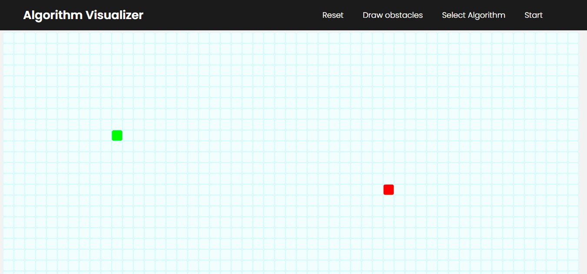

# Algorithm Visualizer
•	Built P5Js application for visualizing different pathfinding and graph based algorithms.

•	Implemented different algorithms in total including A star search, Dijkstra’s, BFS, and DFS algorithms.

# Sample(A star search and Breadth First Search)

# Algorithms Used
1. A star search
2. Dijkstra's Algorithm
3. Depth First Search
4. Breadth First Search

Do give me a star if you like the project :)
